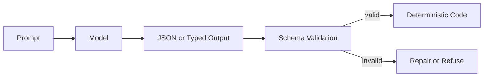

# Structured Output Pattern

## Intent

The Structured Output Pattern constrains model responses to typed data that software can validate, route, store, and test. It is the boundary between natural language reasoning and deterministic application logic.

## Use When

- Model output controls a tool call, workflow branch, policy decision, or database write.
- Downstream code needs stable fields rather than prose.
- You need regression tests for model-assisted behavior.

## Avoid When

- The output is purely creative prose for human reading.
- A deterministic parser already handles the input safely.
- The schema is so broad that it no longer constrains behavior.

## Architecture

## Implementation Notes

- Define schemas close to the code that consumes them.
- Validate every model response before use, even when the provider offers structured output support.
- Prefer enums for routing decisions and discriminated unions for multi-action outputs.
- Log validation failures and repair attempts as first-class evaluation data.

## Failure Modes

- Schemas that mirror prose and provide little safety.
- Silent coercion of missing or invalid fields.
- Prompt-only formatting rules with no validator.
- Overly strict schemas that cause brittle failures on harmless variation.

## Related Patterns

- [Modern Tool Use](../modern-tool-use-pattern/README.md)
- [LLM Router](../llm-router-pattern/README.md)
- [Compliance/Policy Enforcer](../compliance-policy-enforcer-agent/README.md)
