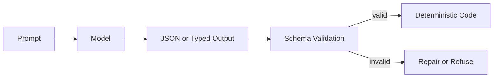

# Structured Output Pattern

## Intent

The Structured Output Pattern constrains model responses to typed data that software can validate, route, store, and test. It is the boundary between natural language reasoning and deterministic application logic.

## Use When

- Model output controls a tool call, workflow branch, policy decision, or database write.
- Downstream code needs stable fields rather than prose.
- You need regression tests for model-assisted behavior.

## Avoid When

- The output is purely creative prose for human reading.
- A deterministic parser already handles the input safely.
- The schema is so broad that it no longer constrains behavior.

## Architecture



## Implementation Notes

- Define schemas close to the code that consumes them.
- Validate every model response before use, even when the provider offers structured output support.
- Prefer enums for routing decisions and discriminated unions for multi-action outputs.
- Log validation failures and repair attempts as first-class evaluation data.
- Keep the validated output close to the next runtime action. A valid object should still pass policy, approval, and state checks before it triggers side effects.

## Failure Modes

- Schemas that mirror prose and provide little safety.
- Silent coercion of missing or invalid fields.
- Prompt-only formatting rules with no validator.
- Overly strict schemas that cause brittle failures on harmless variation.
- A valid object carries unsupported values that violate domain or policy rules.
- Repair loops hide repeated model failures and increase cost without a stop condition.

## Evaluation Strategy

Evaluate syntax, semantics, and downstream safety separately. Schema validity proves that the output can be parsed. It does not prove that the values are correct or safe to execute.

- Test missing required fields, extra fields, invalid enums, wrong types, and malformed nested objects.
- Test values that pass schema validation but violate domain constraints, such as a refund above the order total.
- Test unsupported evidence references and contradictory fields.
- Test one repair attempt, repeated repair failure, and the final refusal or escalation path.
- Test schema-version changes against stored fixtures and downstream consumers.
- Assert that invalid output never reaches tools, policy decisions, or durable state.

Use deterministic validators for structure and domain invariants. Use human or model review only for fields that require judgment.

```ts
type StructuredOutputEvalCase = {
  caseId: string;
  modelOutput: unknown;
  expected: {
    schemaValid: boolean;
    domainValid: boolean;
    actionAllowed: boolean;
    repairAttempts: number;
    finalStatus: "accepted" | "repaired" | "refused" | "needs_human";
  };
};
```

Measure first-pass schema validity, domain-validity rate, repair success rate, repair attempts per accepted output, unsafe acceptance rate, false rejection rate, and schema-version compatibility.

For the shared eval case contract and release-gate method, see [Evaluation-Driven Agent Development](/agent-engineering-practice/evaluation-driven-agent-development).

## Related Patterns

- [Modern Tool Use](../modern-tool-use-pattern/README.md)
- [LLM Router](../llm-router-pattern/README.md)
- [Compliance/Policy Enforcer](../compliance-policy-enforcer-agent/README.md)
- [Evaluation-Driven Agent Development](/agent-engineering-practice/evaluation-driven-agent-development)
